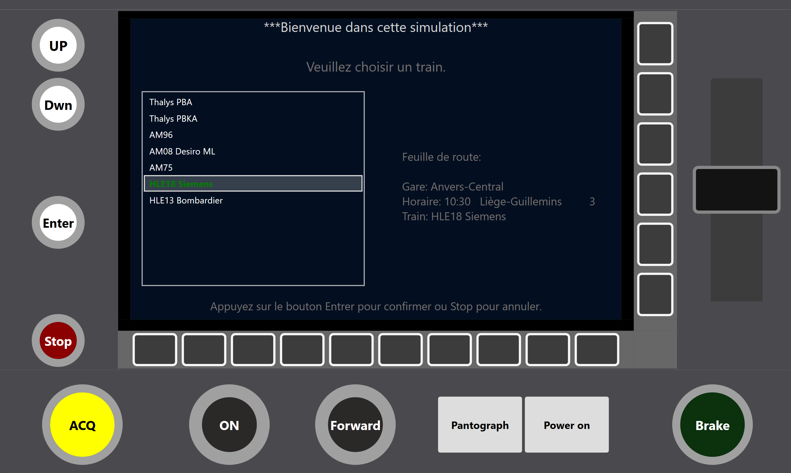
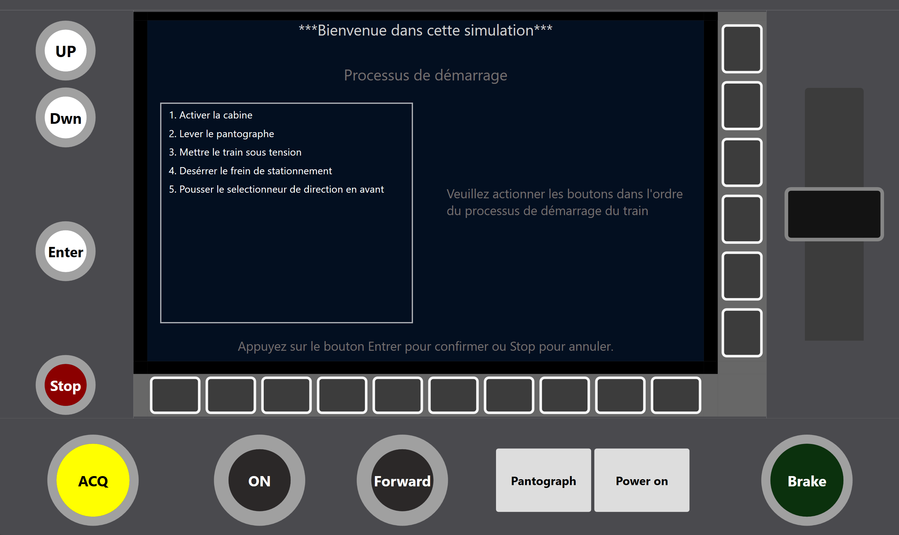
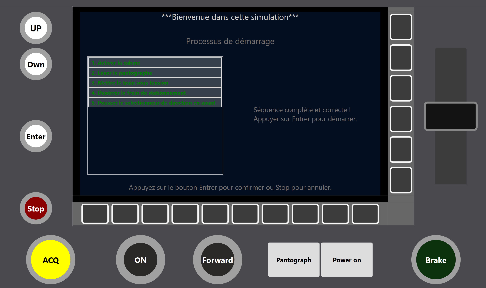
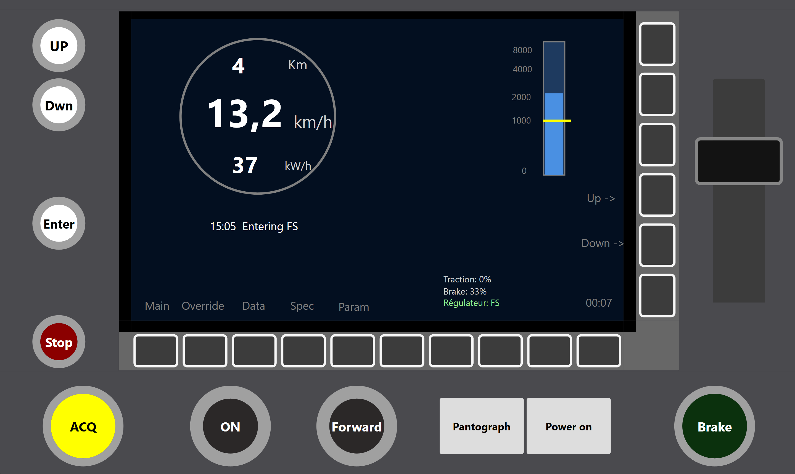

# Train Simulator

> Educational railway driving simulator with realistic physics simulation built in C# WPF


# Screenshots

<table>
  <tr>
    <td> </td>
    <td></td>
  </tr>
  <tr>
    <td> </td>
    <td></td>
  </tr>
</table>

## Overview

A desktop train simulator featuring realistic physics modeling, authentic startup procedures, and an interactive dashboard interface. Built as an educational project to learn railway operations and C# development.

**Key Features:**

- Interactive train cabin controls
- Startup procedure
- Physics-based simulation (Davis equation)
- Belgian railway network (10 stations)
- Real-time performance dashboard

## Quick Start

```bash
# Clone the repository
git clone https://github.com/jonaffrye/TrainSimulatorWPF.git
cd TrainSimulatorWPF

# Open TrainSimulator.sln in Visual Studio
# Press F5 to run
```

**Requirements:** Windows 10+, .NET Framework 4.7.2+ or .NET 6.0+, Visual Studio 2019+

## Physics

The physics simulation is based on the following basic equations:

$F_{net} = F_{traction} - F_{brake} - F_{resistance}$

$F_{resistance} = c_{1} + c_{2} \cdot v + c_{3} \cdot v^2$ (Davis equation)
$a = \frac{F_{net}}{mass}$

**Update:** $v(t+\Delta t) = v(t) + a \cdot \Delta t$

$x(t+\Delta t) = x(t) + v \cdot \Delta t$


- **Physics engine**: Real-time velocity/position calculations using Davis resistance equation
- **Train models**: Different train types (IC, P, L, S) with unique characteristics

#### Simulated Parameters

- **Train mass**: Variable by train type
- **Maximum traction force**: Controlled by throttle
- **Maximum braking force**: Controlled by brake
- **Resistance coefficients**: Realistic friction modeling
- **Velocity and position**: Real-time calculation ($Δt$ = 50ms)

## Interface controls

| Button  | Function         | Button  | Function         |
| ------- | ---------------- | ------- | ---------------- |
| UP/DOWN | Navigate menus   | Enter   | Confirm          |
| Stop    | Exit/Reset       | ON      | Activate cabin   |
| Pant    | Raise pantograph | Power   | Energize systems |
| Brake   | Parking brake    | Forward | Set direction    |
| Slider  | Throttle/Brake   |         |                  |

## Architecture

```
TrainSimulator/
├── TrainSimulator/          # Core logic (Train, Station, Schedule classes)
└── TrainSimulatorWPF/       # UI (WPF panels and controls)
    └── View/
        ├── CenterPanel/     # Main screen & dashboard
        ├── LeftPanel/       # Navigation controls
        ├── RightPanel/      # Regulator slider
        └── BottomPanel/     # System buttons
```

## Contributing

Contributions welcome! Fork the repo, create a feature branch, and submit a PR.

**Guidelines:** Follow C# conventions, test changes, update docs as needed.

## License

MIT License - see [LICENSE.md](LICENSE.md) for details.

Educational use encouraged.

## Acknowledgments

Inspired by Belgian train simulator applications | Built with Microsoft WPF

---
